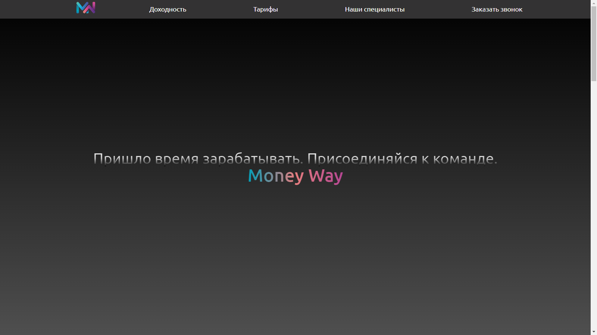
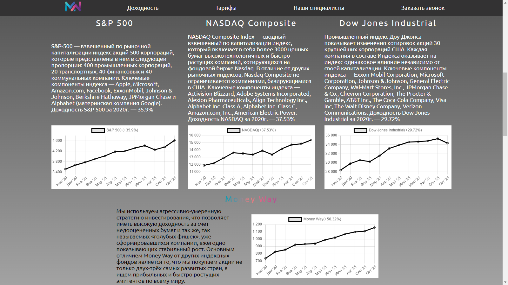
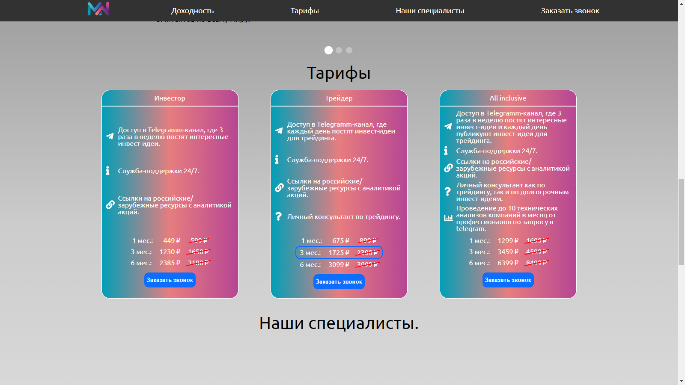
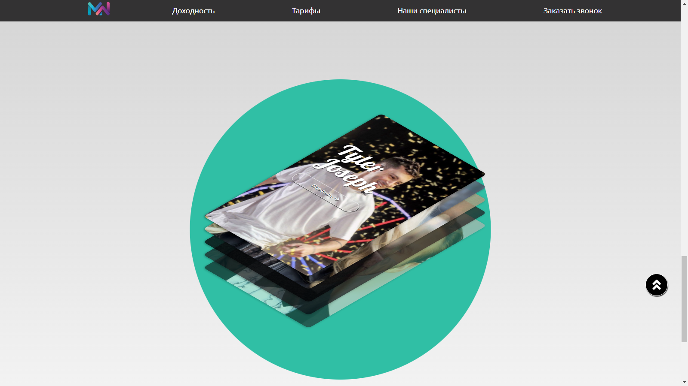
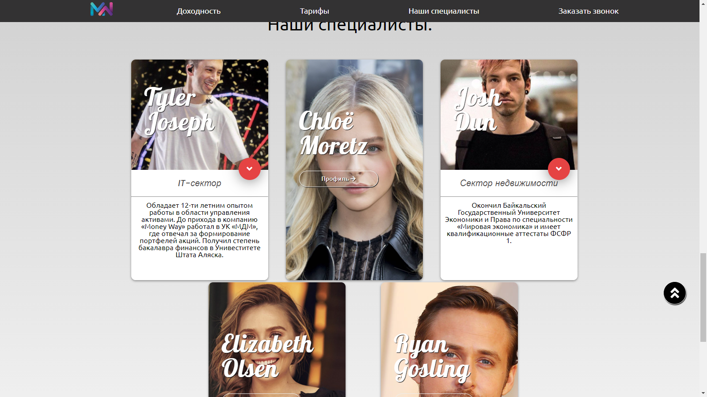
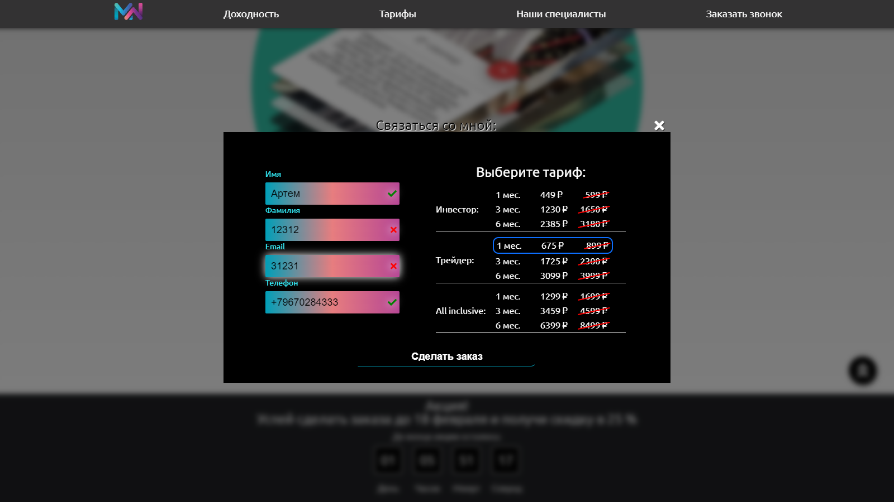

# Money Way

Сайт о инвестиционной команде.

## Превью сайта

На превью отображается заголовок, призывающий вступить в команду. В навбаре есть пункты, при нажатии на который будет плавная анимация до данного раздела. 

____

## Раздел 'Доходность'

В первом разделе описанны успешные инвестиционные фонды, и ниже расположен слайдер с доходностью и особенностями команды 'Money Way'.

____

## Раздел 'Тарифы'

В данном разделе предлагается выбрать один из тарифов команды.

____

## Раздел 'Наши специалисты'

В центре страницы расположены сложенные карточки со специалистами, работающими в данной команде:

При наведении на карточки, они разъезжаются на весь экран, и при нажатии на кнопку 'Профиль' появится информация о данном человеке.

____

## Кнопка 'Заказать звонок'

При нажатии на кнопку __Заказать звонок__ в шапке сайта или же в разделе _Тарифы_ появится вспывающее окно, в котором нужно будет ввести данные о себе и выбрать тариф. 

____

__Сайт написанн на: HTML, SCSS, JavaScript__